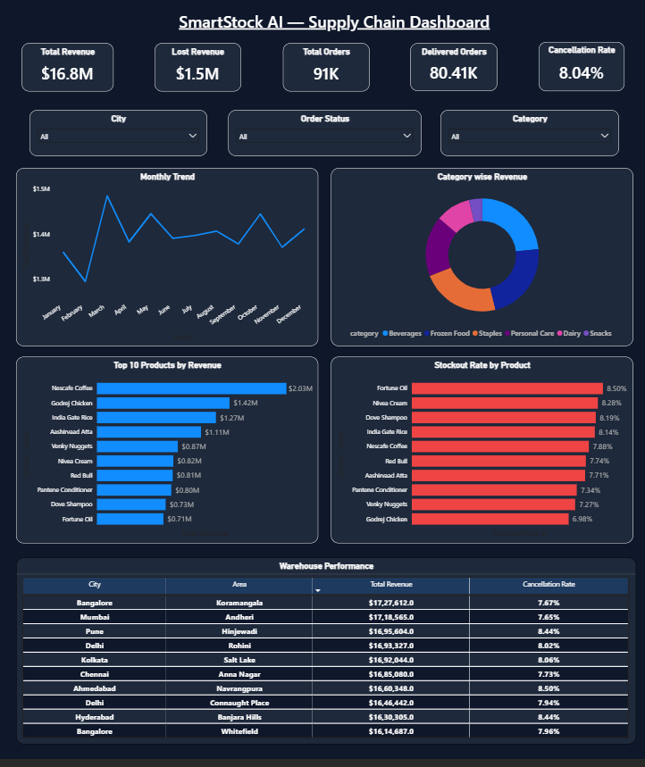

# SmartStock AI — Supply Chain & Demand Forecasting Analytics

> An end-to-end supply chain analytics solution built to identify 
> stockout patterns, measure revenue loss, track warehouse performance, 
> and forecast future demand using SQL, Python & Power BI.

---

## Problem Statement

Quick-commerce companies lose revenue every day — not because of bad 
products, but because no one saw the stockout coming.

Without real-time inventory visibility and accurate demand forecasting, 
businesses face:
- Products going out of stock without warning
- Orders getting cancelled = direct revenue loss
- Warehouses either overstocked or understocked
- Weekend demand spikes consistently missed

**SmartStock AI** solves this by building a complete supply chain 
analytics framework across 10 warehouses, 1,00,000+ orders, and 
6 product categories.

---

## Dashboard Preview



---

## Tech Stack

| Tool | Purpose |
|------|---------|
| PostgreSQL | Database & SQL Analytics |
| Python | Data Generation, EDA, Forecasting |
| Prophet | Demand Forecasting (ML) |
| Power BI | Executive Dashboard |
| Git/GitHub | Version Control |

---

## Project Structure
```
smartstock-ai/
│
├── data/                          # Synthetic CSV datasets
│   ├── orders.csv
│   ├── products.csv
│   ├── warehouses.csv
│   ├── inventory.csv
│   └── deliveries.csv
│
├── sql/                           # PostgreSQL queries
│   ├── 00_create_tables.sql
│   ├── 01_basic_metrics.sql
│   ├── 02_product_analysis.sql
│   ├── 03_revenue_stockout.sql
│   ├── 04_warehouse_analysis.sql
│   └── 05_advanced_analytics.sql
│
├── notebooks/                     # Jupyter notebooks
│   ├── 01_data_generation.ipynb
│   ├── 02_eda_analysis.ipynb
│   └── 03_forecasting.ipynb
│
├── dashboard/                     # Power BI dashboard
│   └── smart_stock_dashboard.pbix
│
└── images/                        # EDA visualizations
```
---

## Dataset

Synthetic dataset generated using Python (Pandas, NumPy, Faker):

| Table | Rows | Description |
|-------|------|-------------|
| orders | 91,457 | Customer orders across 2023 |
| products | 30 | 6 categories, real Indian brands |
| warehouses | 10 | 8 cities across India |
| inventory | 300 | Stock levels per warehouse |
| deliveries | 84,104 | Delivery status & delays |

> To regenerate data: Run `notebooks/01_data_generation.ipynb`

---

## SQL Analytics (15 Queries)

| File | Queries | Focus |
|------|---------|-------|
| 01_basic_metrics | Q1-Q2 | Revenue & order summary |
| 02_product_analysis | Q3-Q5 | Top products & stockout rate |
| 03_revenue_stockout | Q6-Q8 | Lost revenue & monthly trends |
| 04_warehouse_analysis | Q9-Q11 | Warehouse & delivery performance |
| 05_advanced_analytics | Q12-Q15 | Rolling avg, MoM growth, inventory turnover |

**Key SQL concepts used:**
- CTEs (WITH clause)
- Window Functions (LAG, RANK, OVER)
- Rolling 7-day averages
- Month-over-Month growth calculation
- Stockout risk classification (CASE WHEN)

---

## Key Business Insights

**Revenue:**
- Total Revenue: $16.8M across 91,457 orders
- Lost Revenue: $1.5M due to stockouts (8.23% loss)
- March 2023 had highest revenue spike (+14.66% MoM)

**Products:**
- Nescafe Coffee was the top revenue driver
- Amul Butter had highest stockout rate (9.05%)
- Beverages category contributed 38% of total revenue

**Warehouses:**
- Bangalore Koramangala — highest revenue ($17.27L)
- Ahmedabad Navrangpura — highest cancellation rate (8.5%)
- All warehouses showed ~15% delivery delay rate

**Forecasting:**
- Prophet model accuracy: **94.69%** (MAPE: 5.31%)
- Frozen Food & Staples: 22% & 15% demand spike predicted for Jan 2024
- Weekly seasonality clearly detected — weekdays higher than weekends

---

## Power BI Dashboard

Single-page executive dashboard covering:
- 5 KPI cards (Revenue, Lost Revenue, Orders, Delivered, Cancellation Rate)
- Monthly Revenue Trend (Line Chart)
- Category wise Revenue (Donut Chart)
- Top 10 Products by Revenue (Bar Chart)
- Stockout Rate by Product (Bar Chart)
- Warehouse Performance (Table)

---

## Business Recommendations

1. **Frozen Food & Staples** — increase stock by 20-25% for Q1 2024
2. **Ahmedabad warehouse** — review replenishment schedule (8.5% cancellation)
3. **Friday restocking** — weekend demand drops, pre-stock on Fridays
4. **Amul Butter** — highest stockout risk, prioritize replenishment
5. **Prophet model** — retrain monthly with new data for best accuracy

---

## Author

**Aditya Sharma**  
B.Tech Computer Science | Data Analytics Enthusiast  
[LinkedIn](https://linkedin.com/in/your-profile) | [GitHub](https://github.com/aditya-datahub)
